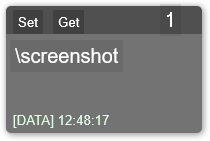
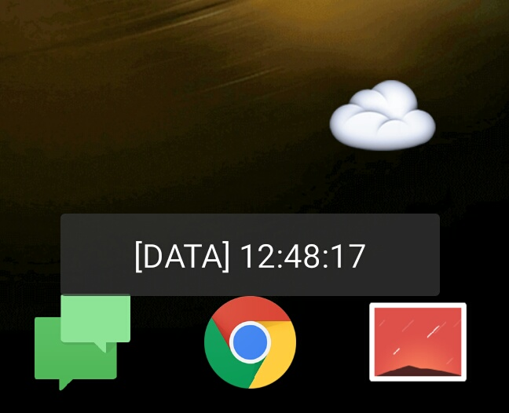

# clipboard-on-cloud-without-compile
一个没有编译器做的云剪贴板，PC to Android.  
 只适用于文字  

使用了 
  Rainmeter on Windows ,
  php on server , 
  tasker on Android

觉得效能不能达到极高，进行到这个程度停止

# 部署方法
## Server
将put.php在可访问的php运行目录
## Windows
1. rainmeter用户文件夹中新建皮肤文件夹
2. 将clipboard.ini放置到这个文件夹中
3. 在Rainmeter中启用这个皮肤配置文件
## Android
1. 将文件‘读取云剪贴板.tsk.xml’ 放置到 /sdcard/Tasker/Tasks 目录下
2. 在Tasker软件中，task选项卡，点击选项卡导入这个配置文件
3. 在桌面建立tasker任务快捷方式

#实现细节
##Server
> 需要一个api和存储，来记录clipboard内容
.php 文件放到服务器上，访问地址通过clip传入文本信息
将会把clipBoard记录写入文件中
## Rainmeter on Windows
1. 使用了plugin : clipboard , 当Measure 发生改变时候，会触发行为
2. measure的值，可以通过[measureName]的方式，传入String measure
3. 使用了WebPost.exe， post 发送数据
## Tasker on Android
1. 使用了tasker的httpd方式，get得到数据。

#未能做到
- https
#可能能做到
- websocket传输
- mqtt

